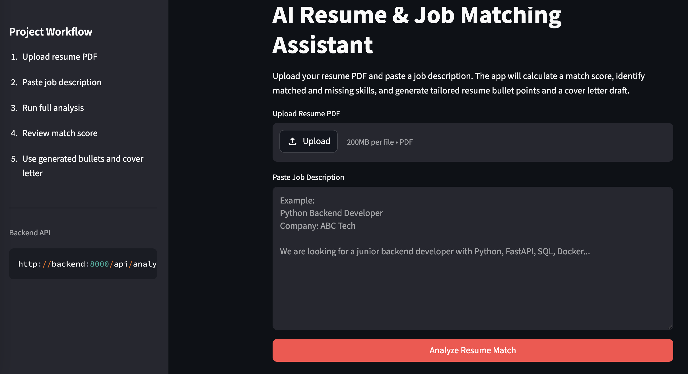
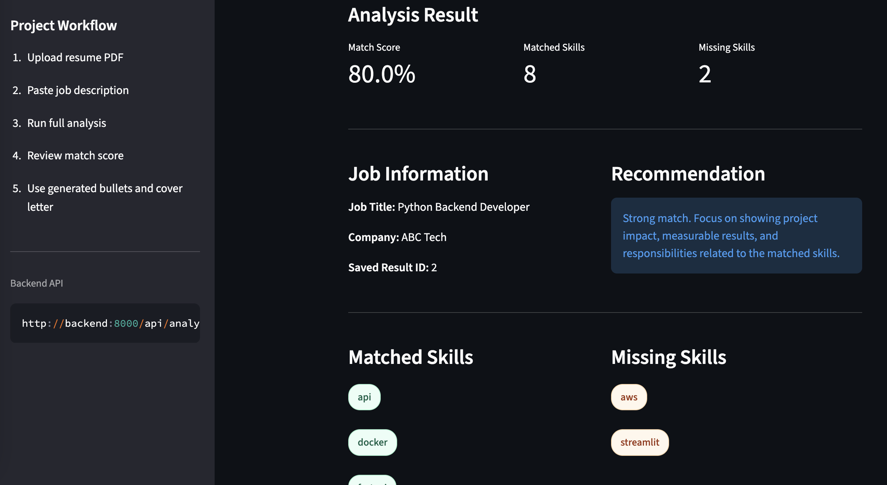
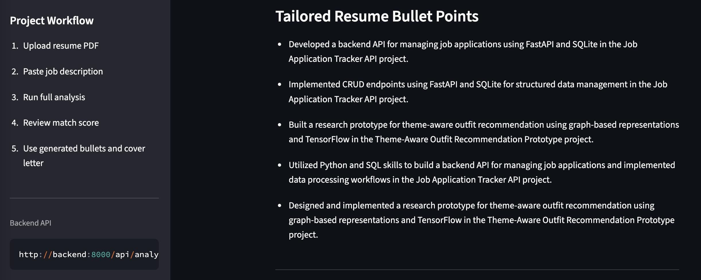
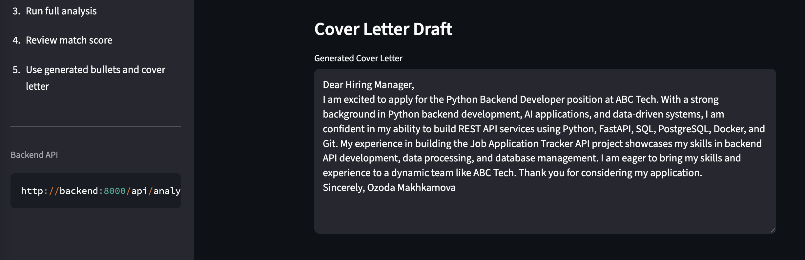
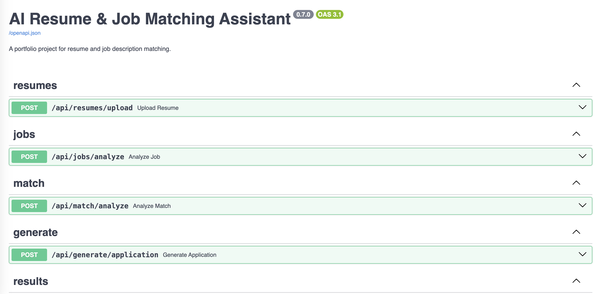

# AI Resume & Job Matching Assistant

A full-stack portfolio project that analyzes a resume PDF and a job description to calculate a skill-based match score, identify matched and missing skills, and generate tailored resume bullet points and a cover letter draft using GenAI.

## Overview

AI Resume & Job Matching Assistant is an end-to-end application for resume-job fit analysis.

Users can upload a resume PDF and paste a job description. The system extracts text from the resume, analyzes job requirements, calculates a rule-based match score, generates tailored resume bullet points and a cover letter draft using GenAI, saves the result to a database, and displays the final analysis in a Streamlit frontend.

This project was built as a backend/AI application portfolio project using FastAPI, Streamlit, SQLAlchemy, SQLite, Docker, and Groq/OpenAI-compatible GenAI integration.

---

## Features

- Resume PDF upload
- PDF text extraction
- Job description analysis
- Skill extraction
- Rule-based match score calculation
- Matched skill detection
- Missing skill detection
- GenAI-based resume bullet point generation
- GenAI-based cover letter draft generation
- Fallback generation mode without paid API usage
- Result saving with SQLite
- FastAPI backend
- Streamlit frontend
- Docker Compose setup
- GitHub-ready project structure

---

## Tech Stack

### Backend

- Python
- FastAPI
- SQLAlchemy
- SQLite
- pypdf
- Groq API
- OpenAI-compatible GenAI structure

### Frontend

- Streamlit
- Requests

### DevOps

- Docker
- Docker Compose

---

## Project Architecture

```text
Resume PDF + Job Description
        |
        v
Streamlit Frontend
        |
        v
FastAPI Backend
        |
        |-- PDF text extraction
        |-- Job description analysis
        |-- Skill extraction
        |-- Rule-based match score calculation
        |-- GenAI text generation
        |-- Result saving
        v
SQLite Database
```

---

## Main Workflow

The main workflow is handled by:

```text
POST /api/analysis/run
```

This endpoint accepts a resume PDF and a job description, then performs the full analysis pipeline:

1. Upload resume PDF
2. Extract resume text
3. Analyze job description
4. Extract resume and job skills
5. Calculate match score
6. Generate tailored resume bullet points
7. Generate a cover letter draft
8. Save the result to the database
9. Return the final analysis result to the frontend

---

## API Endpoints

| Method | Endpoint | Description |
|---|---|---|
| GET | `/health` | Check backend status |
| POST | `/api/resumes/upload` | Upload resume PDF and extract text |
| POST | `/api/jobs/analyze` | Analyze job description |
| POST | `/api/match/analyze` | Calculate resume-job match score |
| POST | `/api/generate/application` | Generate resume bullets and cover letter |
| POST | `/api/results/save` | Save analysis result |
| GET | `/api/results` | List saved analysis results |
| POST | `/api/analysis/run` | Run the full resume-job analysis workflow |

---

## GenAI Provider Modes

This project supports multiple generation modes.

| Provider | Description |
|---|---|
| `fallback` | Rule-based text generation without external API calls |
| `groq` | GenAI generation using Groq API |
| `openai` | GenAI generation using OpenAI API |

For free local testing, use:

```env
GENAI_PROVIDER=fallback
```

For Groq API testing:

```env
GENAI_PROVIDER=groq
GROQ_API_KEY=your_groq_api_key_here
GROQ_MODEL=llama-3.1-8b-instant
```

---

## Environment Variables

Create a `.env` file based on `.env.example`.

```env
GENAI_PROVIDER=fallback

OPENAI_API_KEY=
OPENAI_MODEL=gpt-4.1-mini

GROQ_API_KEY=
GROQ_MODEL=llama-3.1-8b-instant

DATABASE_URL=sqlite:///./resume_matcher.db
```

Example for Groq mode:

```env
GENAI_PROVIDER=groq

OPENAI_API_KEY=
OPENAI_MODEL=gpt-4.1-mini

GROQ_API_KEY=your_groq_api_key_here
GROQ_MODEL=llama-3.1-8b-instant

DATABASE_URL=sqlite:///./resume_matcher.db
```

---

## Run Locally

### 1. Clone the repository

```bash
git clone https://github.com/YOUR_USERNAME/ai-resume-job-matching-assistant.git
cd ai-resume-job-matching-assistant
```

### 2. Create a virtual environment

```bash
python -m venv .venv
```

Activate it on Windows:

```bash
.venv\Scripts\activate
```

Activate it on macOS/Linux:

```bash
source .venv/bin/activate
```

### 3. Install dependencies

```bash
pip install -r requirements.txt
```

### 4. Create `.env`

```bash
copy .env.example .env
```

On macOS/Linux:

```bash
cp .env.example .env
```

### 5. Run the backend

```bash
uvicorn backend.app.main:app --reload
```

Backend API docs:

```text
http://127.0.0.1:8000/docs
```

### 6. Run the frontend

Open another terminal and run:

```bash
streamlit run frontend/streamlit_app.py
```

Frontend:

```text
http://localhost:8501
```

---

## Run with Docker

Make sure Docker Desktop is running.

Build and start all services:

```bash
docker compose up --build
```

Open:

```text
Frontend: http://localhost:8501
Backend Docs: http://localhost:8000/docs
```

Stop services:

```bash
docker compose down
```

Run in the background:

```bash
docker compose up --build -d
```

View logs:

```bash
docker compose logs -f
```

---

## Docker Services

| Service | Description | Port |
|---|---|---|
| `backend` | FastAPI backend server | `8000` |
| `frontend` | Streamlit frontend app | `8501` |

The frontend communicates with the backend through the Docker Compose service name:

```text
http://backend:8000
```

The SQLite database and uploaded files are stored in the local `data/` directory through a Docker volume.

---

## Screenshots

### Streamlit Frontend



### Match Result



### Generated Resume Bullets



### Cover Letter Draft



### FastAPI Docs



---

## Project Structure

```text
ai-resume-job-matching-assistant/
├─ backend/
│  └─ app/
│     ├─ api/
│     │  ├─ analysis.py
│     │  ├─ generate.py
│     │  ├─ jobs.py
│     │  ├─ match.py
│     │  ├─ results.py
│     │  └─ resumes.py
│     ├─ core/
│     │  └─ config.py
│     ├─ db/
│     │  └─ database.py
│     ├─ models/
│     │  └─ analysis_result.py
│     ├─ schemas/
│     │  ├─ analysis.py
│     │  ├─ generate.py
│     │  ├─ job.py
│     │  ├─ match.py
│     │  └─ results.py
│     ├─ services/
│     │  ├─ genai_service.py
│     │  ├─ job_service.py
│     │  ├─ match_service.py
│     │  ├─ pdf_service.py
│     │  └─ skill_service.py
│     ├─ utils/
│     │  └─ skill_keywords.py
│     └─ main.py
├─ frontend/
│  └─ streamlit_app.py
├─ data/
│  └─ uploads/
│     └─ .gitkeep
├─ screenshots/
├─ Dockerfile.backend
├─ Dockerfile.frontend
├─ compose.yaml
├─ .dockerignore
├─ .env.example
├─ .gitignore
├─ requirements.txt
└─ README.md
```

---

## How the Match Score Works

The match score is calculated using a rule-based approach.

```text
match score = matched job skills / total job skills × 100
```

Example:

```text
Job skills:
python, fastapi, sql, docker, aws

Resume skills:
python, fastapi, sql

Matched skills:
python, fastapi, sql

Match score:
3 / 5 × 100 = 60%
```

This deterministic approach keeps the score explainable, reproducible, and cost-free.

GenAI is used for natural language generation, including:

- Tailored resume bullet points
- Cover letter draft
- Application-oriented wording

---

## Example Output

```json
{
  "result_id": 1,
  "resume_filename": "resume.pdf",
  "job_title": "Python Backend Developer",
  "company_name": "ABC Tech",
  "match_score": 71.43,
  "resume_skills": ["python", "fastapi", "sql", "git"],
  "job_skills": ["python", "fastapi", "sql", "docker", "aws", "git"],
  "matched_skills": ["python", "fastapi", "sql", "git"],
  "missing_skills": ["docker", "aws"],
  "recommendation": "Moderate match. Improve your resume by emphasizing relevant projects and filling key missing skills.",
  "tailored_bullets": [
    "Built backend-focused projects using Python and FastAPI with emphasis on clean API design.",
    "Developed structured data processing workflows for user-provided inputs."
  ],
  "cover_letter": "Dear Hiring Manager..."
}
```

---

## Version History

| Version | Description |
|---|---|
| v0.1 | Created FastAPI project structure and health check endpoint |
| v0.2 | Added resume PDF upload and text extraction |
| v0.3 | Added job description analysis |
| v0.4 | Added rule-based match score calculation |
| v0.5 | Added GenAI resume bullet and cover letter generation |
| v0.6 | Added result saving with SQLite |
| v0.6.5 | Added full analysis workflow endpoint |
| v0.7 | Added Streamlit frontend, Docker Compose setup and GitHub documentation polish |

---

## Portfolio Highlights

This project demonstrates:

- REST API design with FastAPI
- Backend service layer separation
- File upload handling
- PDF text extraction
- Rule-based NLP and skill matching
- GenAI integration with fallback mode
- External LLM provider configuration
- Database persistence with SQLAlchemy
- Streamlit frontend development
- Docker-based local deployment
- Clean backend/frontend project organization
- GitHub-ready documentation

---

## Future Improvements

- PostgreSQL support with Docker Compose
- User authentication
- Resume history management
- Multiple job comparison
- Better skill synonym normalization
- OCR support for scanned resume PDFs
- Download generated cover letter as PDF or DOCX
- Export analysis results as CSV
- Add unit tests for service functions
- Add deployment configuration

---

## Notes

Uploaded resume PDFs and local database files are excluded from Git using `.gitignore`.

The `data/uploads/.gitkeep` file is included only to preserve the upload folder structure in GitHub.

```gitignore
data/uploads/*
!data/uploads/.gitkeep
*.db
.env
```

---

## License

This project is for portfolio and educational purposes.